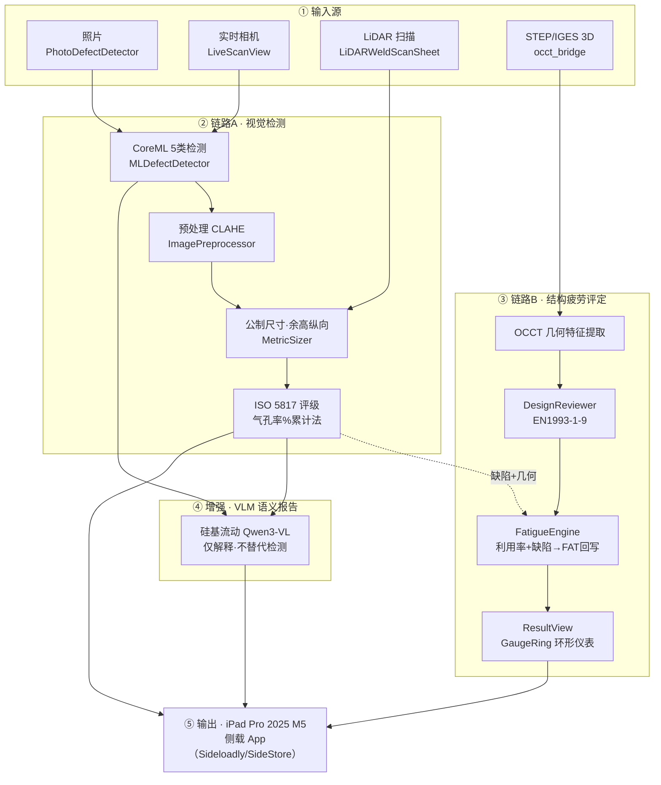

# 焊缝缺陷识别及判定 — 方法论与开发手册（全周期复盘版）

> 项目代号：**WeldFatigueChecker**（iOS 原生，Xcode 26 / iOS 26，iPad Pro 2025 11" M5 侧载）
> 维护者：haoinkel ｜ 文档版本：v3.0（从 9 月 5 日立项起全周期复盘）｜ 2026-09-27
> 适用场景：焊缝表面缺陷 AI 视觉检测 + 基于 ISO 5817 / EN 1993-1-9 的焊接疲劳评定一体化工具

---

# 0. 系统总览流程图（一眼看明白）

> 下图用 Mermaid 描述程序端到端工作流：**四种输入 → 两条主链路（A 视觉检测 / B 结构疲劳评定）→ VLM 增强与环形仪表汇总 → iPad 侧载输出**。GitHub 与多数 Markdown 渲染器可直接显示；箭头 `缺陷→FAT 回写` 表示路径 A 的 ISO 5817 判定定量进入路径 B 的疲劳验算。



---

# 0.1 重点速查（必读 · 防回归）

> 打开手册先读本节。以下 8 条是**最不能错、最易踩坑、最该优先查看**的红线与现状，凡涉及改动须先对照，避免把已修通的判定逻辑或已部署模型搞坏。

| # | 级别 | 重点项 | 一句话说明 / 出处 |
|---|---|---|---|
| 1 | 🔒 不可删改 | **三项核心功能铁律** | ① 3D STEP/IGES 导入（OCCT 桥接 + Model I/O）；② EN 1993-1-9 设计评定（DesignReviewer + FatigueEngine + en1993_1_9.json）；③ 缺陷→疲劳相关性评定（FAT 回写 + ResultView 环形仪表）。任何 UI/C1 异步化/规则引擎重构**只许改"在哪跑/怎么显示"，不许改计算逻辑与文件**（SOP-B 守护清单） |
| 2 | ⚠️ 铁律 | **VLM 只解释、绝不改写 YOLO 检测结果** | `VLMReportService` / `eval_weld_vlm` 的 SYSTEM_PROMPT 锁死：VLM 仅给语义报告（成因/条款/NDT 建议），不得篡改 bbox 判定。GPT-4V 焊缝质量仅 77% 且漏未熔合 → VLM 严禁替代检测（§16.3 文献） |
| 3 | ⚠️ 易混 | **两个"120 轮"不是同一个** | bbox 检测 120 轮（`weld_train.py` → `WeldDefectModel`）**已跑过、已部署、勿重跑**；seg 分割 120 轮（`prepare_seg_labels.ipynb` → `WeldSegModel`）**从未跑过、已推迟到样本够**（§17.4）。两文件/脚本/用途不同，互不覆盖 |
| 4 | ⚠️ 陷阱 | **seg 续连陷阱** | 加新样本后跑训练 cell 前，**必须删掉 `runs/segment/weld_seg_v1*/`**（或移走 `weld_seg_last_backup.pt`），否则 `_find_last()` 会 `resume` 旧权重+旧数据集，新样本不进训练（§17.1 红区 / B 日志） |
| 5 | 🔴 最大风险 | **新代码从未真机编译** | 全部 Swift 改动（含 9/28 大批次与 9/29）本机无 Mac **未实编译**，CI（GitHub Actions）是唯一真验证点。下月 `git push` 后**必看 Actions 是否绿**；9/28 已排掉 `perClassConfidenceThreshold` 未定义，OCCT 8.0.1 iOS 交叉编译仍是历史隐患（§17.3） |
| 6 | ⚠️ 待提交 | **9/29 改动全部未提交** | 工作树脏：`e4b7638` 已含 `WeldDefectModel.mlpackage`，无大文件漏提交风险。下月一次性 commit 9/29 全部改动 + `git push origin main`（快进）；**勿 `git add -A`**，手动指定文件（§17.4 / `.gitignore` 已忽略自拍原图与日志） |
| 7 | 🟡 短板 | **数据集严重偏科** | 自采标注仅 **3 张 undercut**，porosity 仍 0 张 → seg 为 bootstrap、检测可能偏科。攒样本时尽量每类都补（尤其 porosity），否则训出偏科模型（§17.1 红区 / 采集SOP） |
| 8 | ✅ 免责 | **安全关键构件须持证 NDT 确认** | App 是工业**辅助**评定原型，代码已写 AI 免责声明；裂纹/未熔合等安全关键判定**不替代**认证检验与无损检测（ISO 17635），最终以持证人员结论为准（§1/§17） |

> **查看优先级建议**：改代码前 → 看 ① ② ⑤；跑训练前 → 看 ③ ④ ⑦；发版/提交前 → 看 ⑤ ⑥；交付用户前 → 看 ⑧。

---

# 0.2 必备依赖速查（缺一则对应功能失效）

> 本节列出**实现该功能必须具备**的网址/服务、方法/逻辑、数据文件。与 §0.1 的区别：§0.1 是「约束 / 红线」，本节是「原材料 / 算法」——任何一项缺失，对应功能**无法落地**。标 🔑 = 唯一不可替换（缺了该功能直接归零）；🔄 = 必备但可换同类（换一个等效端点/环境/库即可）。

## 0.2.1 必备在线服务 / 账号（网址）
| 功能 | 必备项 | 可替 | 链接 |
|---|---|---|---|
| C·VLM 语义报告 | 云端 VLM 兼容端点（主：硅基流动；备：通义 / Claude / GLM-4V） | 🔄 | https://api.siliconflow.cn/v1/chat/completions（硅基流动）｜ https://dashscope.console.aliyun.com（通义）｜ https://platform.claude.com（Claude）｜ https://open.bigmodel.cn（GLM-4V）|
| 出包 / 编译验证 | GitHub 仓库 + Actions（无 Mac 时唯一真编译验证点） | 🔑 | https://github.com/haoinkel/weld-fatigue-checker ｜ /actions |
| 模型训练 | AI Studio（notebook 训练，持久目录 `/home/aistudio/work/`）或本地 GPU | 🔄 | https://aistudio.baidu.com/ |
| App 分发 | Sideloadly / SideStore（无 App Store，侧载唯一路径） | 🔑 | Sideloadly 官网 ｜ SideStore |

## 0.2.2 必备方法 / 逻辑（算法，缺了功能失效）
| 功能 | 必备逻辑 | 说明 |
|---|---|---|
| 公制尺寸 | `pxPerMm = fx / 中位深度`（自动标定，免参照物）+ 针孔反投影 `depth × (pixel − principal)/fx` | 缺 LiDAR 深度则**无法公制**；可用参照物标尺标定替代，但需人工放标尺 |
| 缺陷→FAT 回写 | §14 闭环：裂纹/未熔合强制判废、几何缺陷降一级 FAT、算利用率 | 缺了链路 A 判定进不了链路 B，疲劳评定与照片**脱离** |
| ISO 5817 评级 | 气孔率%累计法（单孔直径 + 截面累计%双判据）+ 裂纹/弧坑裂纹**零容忍一票否决** | 缺了评级无依据、安全关键缺陷漏判 |
| VLM 锚定 | SYSTEM_PROMPT 锁死「只解释、不改写」+ 引用 ISO 5817 条款 | 缺了 VLM 跑题或越权改写检测 |
| STEP 几何提取 | OCCT `STEPControl_Reader` 读几何 → `DesignReviewer` 匹配细部类别 | 缺 OCCT 库则 3D 导入**整体失效** |

## 0.2.3 必备数据 / 文件（缺了无法运行）
| 文件 | 用途 | 可替 |
|---|---|---|
| `WeldDefectModel.mlpackage` | 5 类检测模型（已部署） | 🔑 |
| `iso5817.json` | ISO 5817 缺陷质量等级表 | 🔑 |
| `en1993_1_9.json` | EN 1993-1-9 FAT 阶梯表 | 🔑 |
| `occt_bridge`（OCCT 8.0.1 静态库，iOS 交叉编译） | STEP/IGES 导入 | 🔑（历史交叉编译隐患）|
| 标注数据集 | 训练 / seg 所需；当前仅 3 张 undercut | 🔄（必备但可扩充）|

## 0.2.4 必备标准规范（判定依据，必须按其实现）
- **ISO 5817:2023** — 焊缝缺陷质量等级（评级唯一依据）｜ https://www.iso.org/standard/84911.html
- **EN 1993-1-9** — 钢结构疲劳 FAT 评定（疲劳唯一依据）｜ https://www.phd.eng.cam.ac.uk/research/fatiguedatabook/fatiguebook/endetails/en1993-1-9/
- **ISO 6520-1** — 缺陷 6 大类分类（与模型 class 对齐）｜ https://www.iso.org/standard/39713.html
- **ISO 17635** — 安全关键构件 NDT 确认（免责依据）｜ https://www.iso.org/standard/50631.html

> 🔑 **硬骨头 5 项**：`WeldDefectModel` / `iso5817.json` / `en1993_1_9.json` / OCCT 库 / GitHub+CI——任何一项缺失或编译失败，对应核心功能**直接归零**（检测、评级、疲劳、3D 导入、出包分别失效）。🔄 项有同类替代，但替代端点/环境也必须**真实可用**（如 VLM 端点须能返回 JSON、AI Studio 须能跑 notebook）。

---

# 第一部分　从 9 月 5 日立项开始的完整复盘

## 1. 立项首日（2026-09-05）：先解决"能不能做、怎么做"

**用户最初的两个问题**：
1. 这个焊缝检测 / 疲劳评定 App **怎么做**？
2. **iPad Pro 2025 11" M5 上没有 Mac，能不能装、怎么用？**

**当天确立的关键认知与决策**：

| 问题 | 结论 | 影响 |
|---|---|---|
| 没有 Mac 能不能用 iPad 跑？ | **Mac + Xcode 只在"构建侧"需要**，设备侧（iPad）不需要 | 决定了交付链路：Windows 写代码 → GitHub Actions CI 出 IPA → Sideloadly / SideStore 侧载 |
| 先出什么形态最快可用？ | **先出 PWA**（当天即可安装到 iPad），**同时并行起原生 SwiftUI** | 形成"PWA + 原生"双形态，先解决有无，再解决深度能力 |
| 要不要上 3D？ | 先覆盖标准查询（ISO 5817、EN 1993-1-9），STEP 导入作为后续能力 | 决定了功能优先级排序 |

> 注：9/5 当天用户还在并行推进另一条主线（丹纳赫 PSP / SRT005 圈梁返工 5Why 分析）。本任务是同期启动的第二条工作线。

## 2. 第一阶段（9/05 – 9/11）：双形态成型，撞上 LiDAR 沙箱墙

**做了什么**：
- **PWA 版 + 原生 SwiftUI 版并行开发**，内置 ISO 5817 与 EN 1993-1-9 标准包；
- 修掉 3 个真实 bug：缺 Service Worker 注册（PWA 离线失效）、缺 EN 1993 标准包、缺 Info.plist 键（相机/相册权限崩溃）；
- 用户提出：**PWA 能不能用 LiDAR 测尺寸？**

**关键转折**：
- 结论是**不能**——PWA 跑在 WebKit 沙箱里，**拿不到 LiDAR 深度数据**；
- 于是 LiDAR 能力**必须走原生**：实现 `LiDARMeasureSheet.swift`（ARKit raycast）+ `LidarScaleCalibrator`；
- 用户进一步要求"**连续测量模式**"（批量缺陷自动排队、顺序测量、自动跳下一个）。

> 这一阶段埋下了后来 **LiDAR 自动标定**（`pxPerMm = fx / 中位深度`，免参照物）的种子——它正是"PWA 测不了、原生才能自动标定"这条分野的延续。

**阶段成果**：PWA 当天可安装可用；原生 LiDAR 路径打通；明确了"要真正做深，必须原生化"。

## 3. 第二阶段（9/20 – 9/21）：3D STEP 导入与 CI 苦战

**目标**：让 App 能**直读 STEP/IGES**，为 EN 1993 结构评估提供几何输入。

**CI 排障（GitHub Actions run #34–#37）**，连续修掉 4 个 OCCT 8.0.1 iOS 交叉编译问题：

| # | 问题 | 修复 |
|---|---|---|
| 1 | OCCT 头文件实际装在 `include/opencascade/`，不是 `iphoneos/inc/` | 修正拷贝路径 + 加 `TopoDS_Shape.hxx` 存在性校验 + 缓存升 v4 |
| 2 | C++ 标准版本不对 | `occt.xcconfig` 加 `CLANG_CXX_LANGUAGE_STANDARD=gnu++17` |
| 3 | xcconfig 注释语法错误（`#` 不是合法注释） | `#` 改 `//` |
| 4 | 引用了不存在的 `IFSelect_Reader.hxx` | 换成 `IFSelect_ReturnStatus.hxx` |

**阶段成果**：`occt_bridge.mm`（`STEPControl_Reader`）打通，STEP / IGES / OBJ / STL / PLY / USDZ / GLB / GLTF 多格式导入可用；这也就是后来被列为"**不可删改**"的核心能力之一。

## 4. 第三阶段（9/26 – 9/27）：模型侧——训练、部署与三批优化

### 4.1 数据集整合
- 合并多源（`huangyebiaoke` 等，缺失源如 `jian_song` / `lohi` / `kunkun` 自动跳过）；
- 统一重映射为 **5 类**：`porosity`(气孔) / `crack`(裂纹) / `undercut`(咬边) / `overlap`(焊瘤) / `unfused`(未熔合)；
- 各类框数极不均衡（porosity 5191 vs undercut 35）→ 引入过采样与合成增强。

### 4.2 第一次跑偏（重要教训）
- AI 把 **epoch 10 早停版**（val mAP50 = 0.963）导出 CoreML 交给用户"交差"；
- 用户一句话点醒：**"跑偏了吧……需要解决我训练不下去的问题，现在怎么不需要训练了？？"**
- **真问题**：训练脚本没有 resume 能力 → AI Studio 长训练被回收杀进程后进度全丢 → 永远跑不到 120 轮。早停版只是绕过了问题。

### 4.3 根因修复
- `weld_train.py` 加入**断点续训**（`YOLO(last.pt).train(resume=True)`，epoch 跨会话累加）；
- 加入 **`--fresh` 开关**（仅在刻意首次启动使用）；
- 固化增强策略：copy_paste=0.45、少数类过采样 ×1.5、mixup=0.1、几何增广、epochs=120、patience=30、seed=42。

### 4.4 分三批优化落地
**第一批 · 正确性 bug**
- B1：`ISO5817Grader` 补别名 `unfused → lack_of_fusion`（否则未熔合无法评级）；
- B2：`defectMeasurePx` 把 `overlap` 并入**竖向（进图方向）**量取，对齐"余高=纵向"需求；
- A2：`KnowledgeBank` 内置 ID 统一为 v5（`W_CRUCIFORM_TOE_80` 等），消除分叉。

**第二批 · 性能与精度**
- INT8 量化导出（体积 ~1.5MB、推理快 50~70%）；
- 按类置信度阈值（crack/undercut=0.30，porosity/overlap=0.45，unfused=0.40）；
- ISO 5817:2023 复核（弧坑裂纹/表面裂纹零容忍）+ NDT 免责声明；
- LiDAR 自动标定回填 `photoPxPerMm`；
- 小目标检测头 `yolov8n_weld.yaml`（160×160）。

**第三批 · 界面统一**
- `Theme.defect` 语义色、`GaugeRing` 环形仪表、`DefectTypes` 5 类枚举；
- 工作流步骤条、缺陷严重度排序、检测历史、无障碍标签、Tab 去歧义（"3D 设计"→"细部设计"、"3D 模型"→"STEP 模型"）。

### 4.5 异步化（C1）与核心功能守护
- `Store.run()` 从主线程同步改为**后台异步**（`DispatchQueue.global` 跑 `DesignReviewer.assess`，主线程回写），大图/连续扫描不卡 UI；
- 用户明确要求"基本功能不要变" → **现场核代码确认三条核心链路计算逻辑一行未改**，并写入项目长期记忆作为护栏。

### 4.6 120 轮长跑实战（本轮最硬的一仗）
| 时间 | 事件 | 处理 |
|---|---|---|
| 首日 | 跑 `--fresh` 时被环境回收，旧 runs(`-0`~`-5`) 已删、新训刚起步被杀 → **进度归零** | 定铁律：中断续训**永远裸跑**，绝不带 `--fresh` |
| 09-27 上午 | 环境回收（长期未活跃），检查确认 `work/` 文件全存活，找到 `last.pt`，已跑 **44/120** | 接力续训 |
| 20:56 | `%run` cell 显示"已停止"（执行器超时/回收） | 发现 cell 内后台进程会被平台清理 → 改用 `%run` 接力模式 |
| 21:10 | 续训崩溃：`CUDA error: uncorrectable ECC error` —— **V100 显存硬件故障**，非脚本问题 | 查 nvidia-smi 确认 ECC=2、显存已释放 |
| 21:22 | 同卡重试仍在同一位置崩溃 | 定论：该卡硬件损坏，**禁止原地重试**（每次还浪费数分钟数据解包） |
| 21:28 | 重启环境换卡；用 `importlib` 绕过"Please use PaddlePaddle"拦截做 GPU 体检 → **通过** | 换卡成功 |
| 21:30 → | **从 82 轮稳定续训**，mAP50 稳定 0.983，跑向 120 轮自动导出 | 进行中 |

**这一战沉淀的三条硬经验**：
1. **续训才是根本解**——每 epoch 写 `last.pt`，被杀最多丢当前轮，进度跨会话累积（接力，不是重来）；
2. **坏卡要换不要试**——ECC 错误在同一位置稳定复现，重试纯浪费时间；
3. **环境有隐形护栏**——`!` 会被原样传给 bash、字面 `import torch` 会被拦截 → 统一用纯 Python（`glob` / `subprocess` / `importlib`）。

---

# 第二部分　系统方法论（沉淀后的标准做法）

## 5. 总体架构（两条主链路）

```
┌──────────────── 链路 A：视觉检测 ────────────────┐
│ 照片/实时/LiDAR → 5类缺陷(CoreML INT8)            │
│     → 尺寸量取(余高取纵向-进图方向)                │
│     → ISO 5817:2023 评级 + NDT 免责声明            │
└──────────────────────┬───────────────────────────┘
                        │ 缺陷 + 几何 + 接头类型
                        ▼
┌──────────────── 链路 B：结构疲劳评定 ────────────┐
│ STEP/IGES 导入(OCCT) → fillDesign 回填板厚/附件长 │
│     → DesignReviewer(EN1993-1-9 细节类别)         │
│     → FatigueEngine.constantAmplitudeCheck        │
│        (利用率/满足与否/有效FAT)                   │
│     → evaluateImperfections(缺陷疲劳相关性)        │
│     → ResultView(GaugeRing 环形仪表)              │
└──────────────────────────────────────────────────┘
```

**核心功能护栏（不可删改，已写入长期记忆）：**
1. STEP/IGES 3D 导入（`Model3DView` + `occt_bridge`）原样保留；
2. EN 1993-1-9 设计评估（`DesignReviewer` + `FatigueEngine` + `en1993_1_9.json`）原样保留；
3. 疲劳性能评定（`constantAmplitudeCheck` + `evaluateImperfections` + 环形仪表）原样保留。
> 任何 UI / 异步化 / 规则引擎重构，只许改「在哪跑 / 怎么显示」，**不许改上述计算逻辑与文件**。

## 6. 五阶段开发方法论

| 阶段 | 关键动作 | 纪律 / 铁律 |
|---|---|---|
| 1 数据与标注 | 5 类模板、自增、拍照规范、合成增强 | 类别固定 5 类；用户照模板加数据 |
| 2 模型训练 | 120 轮增强、断点续训、INT8 导出 | **`--fresh` 仅首启；中断裸跑续训；坏卡换卡不重试** |
| 3 移动端集成 | CoreML INT8、类别对齐、按类阈值、LiDAR 标定 | class 映射 `{0:porosity,1:crack,2:undercut,3:overlap,4:unfused}` 两端必须一致 |
| 4 规则与标准 | ISO5817:2023、EN1993 FAT 表、NDT 免责 | 标准随官方更新；安全关键须 UT/RT 补充 |
| 5 验证与部署 | CI 出 IPA、侧载、真机 | 无 Mac → git 推送走 CI + iPad 验证 |

## 7. 关键技术决策与权衡

| 决策 | 选择 | 理由 |
|---|---|---|
| 首版形态 | PWA 先行 + 原生并行 | 先解决"当天能用"，LiDAR 深度能力必须原生 |
| LiDAR 能力 | 原生 ARKit（非 PWA） | WebKit 沙箱拿不到深度数据 |
| 缺陷类别数 | 5 类（不细分） | 数据有限，先保召回 |
| 量化 | INT8 | 体积/速度最优，工业缺陷精度可接受 |
| 标定 | LiDAR 自动 + 手动兜底 | 自动免参照；无 LiDAR 仍可手动 |
| 余高量取 | 纵向-进图 | 符合用户测量习惯，与横向解耦 |
| 评估执行 | 主线程→后台异步(C1) | 大图/连续扫描不卡 UI |
| 长训练 | 续训接力 | 每 epoch 写 last.pt，中断成本≈0 |

## 8. 踩坑与教训（八条）

1. **早停版交差（最严重）**：没解决"跑不完"的根因就拿中间产物交差 → 根因是脚本无 resume。
2. **`--fresh` 误删归零**：中断重跑带 `--fresh` 会清空 runs → 续训永远裸跑。
3. **环境回收杀进程**：长期未活跃触发 → 保持页面活跃；`last.pt` 兜底接力。
4. **cell 后台进程被清理**：`!cmd &` / `nohup` 在 Notebook cell 里挡不住平台清理 → 用 `%run` 接力。
5. **GPU 硬件 ECC 故障**：同一位置稳定崩 → nvidia-smi 确认后**换卡，不重试**。
6. **环境护栏**：`!` 被透传给 bash；字面 `import torch` 被拦截（报 "use PaddlePaddle"）→ 统一纯 Python + `importlib`。
7. **类别错位**：CoreML class 顺序与 App 不一致 → 导出前后强制核对映射。
8. **规则引擎四分叉**：同规则在 Python/Swift DesignReviewer/KnowledgeBank/PWA JS 各写 → 已对齐 v5，根治需单一真源。

## 9. 可复用 SOP

**SOP-A 加数据 → 重训 → 部署**
1. 新照片放 `ml/raw_mine/images/` + 按 `imgName.txt` 标注（5 类）；
2. 上传 `weld_train.py` + 数据集到 AI Studio `work/`；
3. GPU 体检（纯 Python，避开字面 `import torch`）；
4. `%run /home/aistudio/work/weld_train.py`（**不带 `--fresh`**）；
5. 被杀就重跑同条（接力）；每 1~2h 备份 `last.pt`；
6. 跑满 120 轮自动 val + 导出 INT8 `WeldDefectModel.mlpackage` → zip 下载 → 覆盖 App `Models/`；
7. 覆盖后核对 `MLDefectDetector.classNames` 顺序未变。

**SOP-B 核心功能守护清单（大改前复核）**
- [ ] STEP/IGES 导入仍可用（occt_bridge 未改）
- [ ] EN1993-1-9 设计评估逻辑未变
- [ ] 疲劳利用率评定与环形仪表数据绑定未变
- [ ] 5 类 class 映射与 App 端一致

**SOP-C 训练中断恢复决策树**
1. 看 `results.csv` 最后轮次 → 2. `ps` 查进程是否还活着 → 3. 活着就别动；死了裸跑续训 → 4. 若报 CUDA ECC / CUDA error → **换环境换卡，不重试** → 5. 换卡后先跑 GPU 体检再启训。

## 10. 当前状态与待办

**模型指标**（120 轮增强版，约 107 轮时实测）：
- **mAP50 ≈ 0.983**（早停版 0.963，明显提升）
- mAP50-95 ≈ 0.64｜Precision ≈ 0.966｜Recall ≈ 0.969

**已落地**：5 类模型、**120 轮增强版 w8a16 权重量化 CoreML 已部署进 App 工程**（2026-09-28 现场确认 weight.bin 3.08MB）、ISO5817:2023、LiDAR 自动标定、按类阈值、UI 统一、C1 异步化、检测历史、工作流引导、无障碍、STEP 导入、EN1993 评估、方法论固化。

**待根治（架构级）**：
- 🔴 **A1** 规则引擎单一真源（`knowledge/*.json` 生成三端）
- 🟡 **C1 延伸** 照片/实时扫描的 CoreML 推理也异步化
- 🟡 **STEP 全自动**：导入即解析接头类型/传力方向（几何特征识别，属新增功能，非原有）
- 🟡 **CI 修复**：Sideloadly / Xcode 26 兼容性验证
- 🟡 **真机验证**：120 轮模型覆盖 App 后在 iPad 上实测

**论文启发方向**：CBAM 注意力、小目标检测头、RGB-D 融合（已有 LiDAR 基础）、合成数据增强、半监督/主动学习降标注成本。

## 11. 2026-09-28 状态确认（用户回溯 9/5 → 至今 + 优化空间审计）

- **120 轮即最新且已部署**：App 工程内 `WeldDefectModel.mlpackage/weights/weight.bin` = 3.08MB、时间戳 09-27 23:56，为 w8a16 120 轮增强版（非早先 5.9MB FP32 epoch10 占位）；全工程无 120 轮之后训练记录。注：w8a16 = INT8 权重+FP16 激活（权重-only），非全 INT8(w8a8 ~1.5MB)，是 Ultralytics 8.4.x 下 CoreML 唯一可用量化档。
- **静态审计消 1 个编译阻断**：`MLDefectDetector.swift` 曾引用未定义的 `perClassConfidenceThreshold`（CI 必崩），已补 5 类字典（porosity0.45/crack0.30/undercut0.30/overlap0.45/unfused0.40）；其余 9/27 新增符号均已有定义。无 Mac 故此前未触发编译，下月 git 推前已排雷。
- **剩余优化空间（按优先级）**：① A1 规则引擎单一真源（R1-R16/FAT 仍多端手写）未根治；② C1 仅覆盖判定计算，照片/实时 CoreML 推理仍在主线程同步（大图/连续扫描仍可能卡）；③ STEP 全自动几何→参数解析=新增非原有；④ CI 修复(OCCT/Sideloadly·Xcode26) 与 iPad 真机 recall 验证待下月 git 推；⑤ 模型可再升：在 AI Studio 用 `LOHI_GDOWN=1` 并入 LoHi-WELD(GDrive 源，CN 墙但云端可达) + 加 `raw_mine` 自拍表面气孔/弧坑裂纹重训。

---

## 12. ISO 5817 缺陷与软件能力覆盖矩阵（全谱系对照）

ISO 5817 按 ISO 6520-1 把熔焊接头缺陷分 6 大类。下表把每一类对齐到软件现有两条检测路径（**摄像头+CoreML 的 5 类** + **LiDAR 几何 3 类**），标注能 / 部分 / 不能及判定可信前提。

| 大类 | 缺陷 | 软件能力 | 说明 |
|---|---|---|---|
| **100 裂纹** | 纵向/横向/弧坑裂纹 | ✅ 能（相机） | CoreML 判出即一票否决（permitted=false）。限制：<~0.2mm 头发丝裂纹相机看不到；只判表面，内部扩展裂纹仍需 MT/PT/UT |
| **200 孔洞** | 气孔/缩孔/弧坑缩孔 | 🟡 部分（相机，仅单孔） | 能框出开放气孔；**判定缺口**：ISO 5817 用「单孔最大直径 + 截面气孔率%」双判据，软件目前只比单孔最大直径 vs `max_pore`，% 累计法未实现（"一堆小气孔"暂不被累计判超差） |
| **300 固体夹渣** | 夹渣/熔剂/氧化物/钨/铜夹杂 | ❌ 不能（需 NDT） | 模型无这些类，LiDAR 也看不见（内部/亚表面）→ 只能 RT/UT |
| **400 未熔合/未焊透** | 表面未熔合、未焊透 | 🟡 部分 | 表面未熔合 `unfused`（相机）一票否决；**未焊透(根部)** 正面相机/LiDAR 看不到 → 不能，需 RT/UT |
| **500 形状偏差** | 余高过大/凸度、咬边、错边、焊瘤 | 🟡 部分（混合） | ✅ 余高过大/凸度、咬边、错边（LiDAR+相机）；焊瘤 `overlap` 加点点云可补悬垂几何（见 §13）；❌ 焊脚不足/throat 不足、根部凹度/凸度、不正确焊趾、烧穿未测 |
| **520 表面粗糙/飞溅** | 飞溅、弧坑、引弧擦伤、打磨痕、未填满弧坑 | ❌ 不能（非 5 类模型） | 多数为相机可见，但需扩充 ML 类别才能自动判 |

**覆盖度小结**
- **完全能**：裂纹、余高过大、咬边、错边、焊瘤（外观）
- **部分能**：气孔（仅单孔直径法）、表面未熔合、形状类里的"不足/根部"缺失
- **完全不能**（需 NDT 或扩模型）：所有固体夹渣、未焊透、根部、飞溅类

**判定可信度前提（重要）**：即便"能"的项，最终汇总判定此前走"路径 B"（Store→DesignReviewer.assess→FatigueEngine.evaluateImperfections）存在正确性 bug——余高阈值因 `ref:"b"` 被当作 1.0 且无 `add`（几乎必判超差）、`permitted` 一票否决字段在 PackLimit/IsoLimit 解码时被静默丢弃（裂纹/未熔合在汇总里显示"未判定"而非 ✗）、气孔只读 `poreMm` 而 ML 路径只填 `sizeMm`。**该 bug 已于 §13 修复**，修复后照片页(路径 A)与最终汇总(路径 B)结论一致。

## 13. 2026-09-28-B 增强实现（四项）

> 目标：让"导入 STEP → 对照 EN 1993 表 8.1~8.10 识别设计合理性"与"按 ISO 5817 出可信判定"闭环。以下改动**未改**工作记忆三大不可删改核心（STEP 导入、EN1993 评估、缺陷疲劳评定），只扩展"在哪跑/怎么显示/判定正确性"。

### 13.1 A — matchDetail 扩到表 8.4/8.5 完整几何维度
- `DesignInput` 新增 `transitionRadiusMm`(r)、`attachmentToeGround`（横向附件焊趾打磨）。
- `DesignReviewer.matchDetail` 重写为按几何/传力维度归类：
  - 对接(8.3)：打磨齐平→125 / 焊态→100
  - 传力十字/T/角(8.5)：焊趾 80
  - 横向非承载附件(8.4)：端部打磨→80 / L≤100 焊态→71
  - 纵向附件(8.4 detail1~3)：按 **r/L** 分级 90 / 71 / 50（此前一律按焊态 50，漏掉高 FAT 情形）
- 新增 **R17 规则**：部分熔透/角焊传力接头须对根部按 FAT36* 双评估（此前只判焊趾会高估疲劳能力）。
- 效果：**手填也能正确归类到细部表**，为后续自动几何解析打地基。

### 13.2 B — OCCT 几何特征自动提取（STEP→特征向量）
- `occt_bridge.h/.mm` 新增 `OCCTFeatures` 结构与 `occt_extract_features()`：读 STEP/IGES 经 `BRepBndLib`+`BRepGProp` 提取包围盒三边长、面/边/实体数、最短边长（过渡半径 r 候选）、拓扑提示 `jointHint`。
- `Model3DView` 在 STEP/IGES 加载后调用，并把"板厚/长度/最短边"回填设计表单（`fillDesign`），`transitionRadiusMm` 自动填最短边候选（标注待人工复核）。
- ⚠️ 诚实边界：**全自动接头类型/传力方向/全熔透识别仍做不到**（需语义解析装配关系，属下一阶段）；当前自动提取的是纯几何量，接头类型/传力方向仍由用户在界面确认。OCCT 代码需 Mac + `USE_OCCT` 编译验证（无 Mac 环境，未实编译）。

### 13.3 路径 B 判定 bug 修复（最终评估可信）
- `IsoLimit`(KnowledgeBank) 与 `PackLimit`(StandardPackRegistry) 增 `permitted` / `add` 字段，消除解码静默丢弃。
- `FatigueEngine.evaluateImperfections`：
  - 加 `permitted` 一票否决（裂纹/未熔合/焊瘤 B,C/根部咬边 B → 直接 ✗，不再"未判定"）
  - `ref:"b"` 正确计算 `v·b + add` 并受 `maxAbs` 截断（余高不再几乎必判超差）
  - 气孔改读 `poreMm ?? sizeMm`（ML 路径 bbox 直径可直接判）
  - 新增 `weldWidthMm` 参数（默认 2t），由 `UserParams` 透传
- 修复后路径 A（照片页）与路径 B（最终汇总）结论一致。

### 13.4 点云/网格扫描补 overlap 与沿缝局部缺陷
- `WeldProfileAnalyzer` 增 overlap 检测（余高非对称悬垂：一侧陡降且明显短于另一侧→疑似焊瘤/满溢）与 `analyzeBand()` 沿缝多点合并（取沿缝最大尺寸，可定位局部凹点/悬垂/余高突变）。
- `WeldScanCoordinator` 增 `sampleDepthColumn/Row(atX/YFraction:)` 与 `captureProfileBand(count:)`，沿焊缝长度方向多点采样（现有 `sceneReconstruction = .meshWithClassification` 已开但此前未用 mesh/点云，本次只用了多剖面采样思路，未直接读 ARMeshAnchor）。
- LiDAR 扫描页 `runScan` 改用 band 分析；overlap 候选写入缺陷清单，走 §13.3 修正后的判定。
- ⚠️ iPad LiDAR ~1mm 点距、~3mm 深度噪声，overlap 仅为"悬垂几何疑似"，最终判定须人工复核。

## 14. 缺陷→FAT 定量回写（2026-09-28-C）

> 解决上一轮收尾时留下的诚实缺口：ISO 5817 缺陷此前在 `assess` 里只生成"建议打磨"的**文字提示**，既不回写 FAT、也不改利用率。本次让缺陷**定量地**进入 EN 1993-1-9 疲劳验算。

### 14.1 规则（保守简化，与 EN 1993-1-9 + IIW 实务一致）
- **一票否决型（强制判废）**：裂纹 `crack`、未熔合 `lack_of_fusion`、未焊透超差 `incomplete_penetration`、以及 `permitted=false` 的不允许级缺陷（焊瘤 B,C / 根部咬边 B / 未熔合…）→ 有效 FAT 直接判废，疲劳结论 **不满足**（与照片页路径 A 一致）。
  - 实现：由 `evaluateImperfections` 在 `permitted=false` 分支置 `ImperfectionResult.notPermitted=true`；`defectFatPenalty` 见 `notPermitted` 即 `forcedFail=true`。
- **几何缺陷降级型**：咬边 `undercut`、根部咬边 `root_undercut`、余高过大 `excess_weld_metal`、焊瘤/满溢 `overlap`（仅 D 级超差时）、错边 `linear_misalignment` → 有效 FAT **降一级**（取 EN 1993-1-9 FAT 阶梯上一档更低值：…100→90→80→71→63→56→50→45→40→36…）。
  - 多个几何缺陷逐项叠加降级，下限 12。
  - 错边若需更细分级，可改用偏心系数 `K_m = 1 + 3e/(2t)` 折减（`e`=错边量，`t`=板厚）；本次为与离散 FAT 模型一致，统一采用"降一级"。

### 14.2 计算链路（写在 `FatigueEngine`）
1. `effectiveFat(detailId, improvements)`：基准 FAT × 改善系数（焊趾打磨×1.3 / 锤击×1.5，上限 125）。
2. `defectFatPenalty(baseFat, inputs, results, thickness)`：在步骤 1 的 FAT 上叠加缺陷折减，返回 `(effectiveFat, notes, forcedFail)`。
3. `allowableCycles(effectiveFat, Δσ, γMf)` 与利用率 `util = N_req / N_allow`；`pass = forcedFail ? false : (util ≤ 1)`。
4. `FatigueResult` 新增 `fatPenalties: [String]`（降级轨迹文案）与 `defectForcedFail: Bool`，供 ResultView 展示。

### 14.3 接入点与展示
- `DesignReviewer.assess`：先算 `evaluateImperfections`（ISO 5817 判定），再把 `vision.imperfections`(输入) 与 `imps`(结果) 同序传入 `constantAmplitudeCheck(defectInputs:defectResults:thickness:)`，实现回写。
- ResultView：在"有效 FAT"下方增加"缺陷折减"区，逐条列出降级轨迹；结论区对强制判废显示"缺陷强制判废 ✗"及红字说明。
- 计划(plan)中 I1 项文案更新为"已折算降低有效 FAT，建议打磨改善疲劳"。

### 14.4 诚实边界
- 本机无 Mac/OCCT，整段 Swift **未经实编译**，仅逻辑与类型审查通过（已处理 `ImperfectionResult`/`FatigueResult` 成员逐一补全、zip 同序对齐）。
- 降级规则是**保守简化**，不是欧标逐字条文；安全关键构件仍须持证人员按 EN 1993-1-9 / ISO 17635 用 NDT 确认。
- **气孔截面气孔率%累计法仍未实现**（§12 已列）：一堆小气孔仍只按单孔直径判，不累计。

---

## 15. 气孔截面累计气孔率%法（2026-09-28-D）

> 解决 §12 / §14.4 遗留的缺口：ISO 5817 对气孔用**两个独立判据**——① 单孔最大直径 ≤ `max_pore`；② 截面累计气孔率 ≤ `pore_rate%`（B≤2% / C≤4% / D≤8%）。此前只判①，"一堆小气孔"会漏判。本次把②也接上，两条路径（照片标注页 / 设计评估）均生效。

### 15.1 评定模型（ISO 5817:2023 表 2/3）
- 评定长度 `l = max(12·t, 150) mm`；评定带宽 = 焊缝宽度 `b`（与设计评估共用 `weldWidthMm`，缺省 2t）。
- 评定区面积 `A = l × b`。
- 各气孔投影面积 `aᵢ = π/4 · dᵢ²`（dᵢ = 单孔直径）。
- 累计气孔率 `R% = (Σ aᵢ) / A × 100`。
- 验收：`最大单孔 d ≤ max_pore` **且** `R% ≤ pore_rate`，两者皆满足才合格。

### 15.2 数据层
- `IsoLimit`(KnowledgeBank) / `PackLimit`(StandardPackRegistry) / `IsoLimitEntry`(ISO5817Grader) 均新增 `poreRate` 字段（JSON key `pore_rate`）。
- `Resources/iso5817.json` 与 `Resources/packs/iso5817.pack.json` 气孔各等级补 `"pore_rate": 2.0/4.0/8.0`；内置兜底 `builtInImperfections` 同步。
- `StandardPackRegistry.current()` 已在 `IsoLimit` 透传中补 `poreRate: l.poreRate`，确保标准包切换后累计上限随之生效。

### 15.3 计算链路
- **设计评估（路径 B）**：`FatigueEngine.evaluateImperfections` 先聚合全部 `porosity` 输入的直径，预计算 `poreRatePct`，再对**每个气孔输入**返回 `accepted = 单孔OK && 累计OK`，limit 文案含"累计气孔率=X%(限≤Y%)"。保持"一项一结果"计数不变，`DesignReviewer.assess` 中 `zip(inputs, imps)` 仍对齐，缺陷→FAT 回写不受影响。
- **照片标注页（路径 A）**：`ISO5817Grader.gradePorosity(pores:t:b:level:)` 做双判据聚合；`PhotoCheckView.regradeAll` 在该焊缝全部气孔直径上调用一次，把结果回填到每个气孔行的 `accepted`/`limitText`，识别完成后即重评。
- 两条路径共用同一目标等级（`store.params.qualityLevel`），结论一致。

### 15.4 顺带修复的潜 bug（重要）
- `evaluateImperfections` 原按 `imp.type` 直接匹配 spec 类型，但 ML 模型输出未熔合为 `"unfused"`、标准库键为 `"lack_of_fusion"` → **未熔合在最终评估里一直匹配不到、一票否决从未触发**。本次加入别名映射（`unfused→lack_of_fusion`、`crater_crack→crack`、`pore/air-hole→porosity`），与照片页路径 A 的 `ISO5817Grader.aliases` 对齐。此前 §14 关于"未熔合在最终汇总一票否决"的结论，现在才真正对模型输出生效。

### 15.5 诚实边界
- 整段 Swift 未经实编译（本机无 Mac/OCCT），仅逻辑与类型审查通过；下月 git 推送 + GitHub Actions CI 才是真验证点。
- 评定区带宽 `b` 在照片页 `gradePorosity` 调用传 `nil`（缺省 2t 近似）；若需精确，可在标定焊缝宽度后传入 `weldWidthMm`。
- 累计法基于"全部气孔都在同一评定长度 l 内"的假设；超大焊缝或分段评定需另行分段处理（当前未按 12t/150 分段切条）。

---

## 16. 用过的有效资源索引（网址 / 文献 / 大模型 / 专利）

> 本文档主线复盘至 2026-09-28；以下索引补齐全程（含 9/29 旁路）实际引用过的有效资源，便于复现与溯源。

### 16.1 平台与详细网址（实测可用 / 排查留痕）
**① 硅基流动 SiliconFlow（C 验证主用）**
- 控制台 / 注册：https://cloud.siliconflow.cn/
- OpenAI 兼容 API 端点：`https://api.siliconflow.cn/v1/chat/completions`（实测 `200` 跑通）
- 模型广场（复制完整模型 ID）：https://cloud.siliconflow.cn/models
- 开发文档：https://docs.siliconflow.cn/
- 主用模型：`Qwen/Qwen3-VL-32B-Instruct`（模型页 https://cloud.siliconflow.cn/models/Qwen/Qwen3-VL-32B-Instruct ）
- 计费：¥1/百万输入 + ¥4/百万输出 tokens，新用户送 16 元代金券

**② 阿里云百炼 / DashScope（最初 VLM 后端，已绕过）**
- 控制台（API-KEY 管理）：https://dashscope.console.aliyun.com/
- 模型广场：https://dashscope.console.aliyun.com/model
- 帮助文档：https://help.aliyun.com/zh/model-studio/
- 注：专属域名 `Endpoint.AccessDenied` 死局已用 ① 绕过，仅作排查留痕

**③ GitHub（权威远程仓库）**
- 仓库：https://github.com/haoinkel/weld-fatigue-checker
- Actions（CI 构建日志）：https://github.com/haoinkel/weld-fatigue-checker/actions

**④ AI Studio（百度 Paddle，训练环境）**
- 平台：https://aistudio.baidu.com/
- 形态：仅 notebook；持久目录 `/home/aistudio/work/`，数据集挂 `/home/aistudio/data`

**⑤ 智谱 GLM-4V（C 备选 VLM，OpenAI 兼容，未实测）**
- 开放平台：https://open.bigmodel.cn/
- API 文档：https://open.bigmodel.cn/api/paas/v4/

**⑥ 通义千问 / Claude（RemoteVLMService 备选 baseURL）**
- 通义（同 ② DashScope）：https://dashscope.console.aliyun.com/model
- Claude（Anthropic）：https://www.anthropic.com/ ｜ 控制台 https://platform.claude.com/

**⑦ 魔搭 ModelScope（国内训练平台，固定训练用）**
- 社区/注册：https://modelscope.cn/
- PAI-DSW 控制台（建 PyTorch GPU 实例）：https://dsw.console.aliyun.com/
- 说明：国内直连免代理、淘宝/阿里账号登录无验证码墙；**须选 PAI-DSW 类型才有 /mnt/workspace 持久化**（EAIS 类型关闭即清空）；GPU 实例空闲>30min 自动释放、单次≤12h；须绑阿里云+实名认证拿免费 GPU 额度

### 16.2 标准与规范（判定核心）
- **ISO 5817:2023** — 焊缝缺陷质量等级（App 判定核心，含气孔率%累计法、弧坑裂纹零容忍）｜ 文本 https://www.iso.org/standard/84911.html
- **EN 1993-1-9** — 钢结构疲劳，设计评估 + FAT 阶梯核心 ｜ https://www.phd.eng.cam.ac.uk/research/fatiguedatabook/fatiguebook/endetails/en1993-1-9/
- **ISO 6520-1** — 焊缝缺陷 6 大类分类（§12 覆盖矩阵引用）｜ https://www.iso.org/standard/39713.html
- **ISO 17635** — NDT 确认（安全关键构件）｜ https://www.iso.org/standard/50631.html
- **IIW 实务** — 缺陷 FAT 降级（§14 引用）｜ 国际焊接学会 https://www.iiw-elsevier.com/

### 16.3 学术文献（优化点依据，附检索入口）
| 文献 | 印证方向 | 关键数据 | 检索入口 |
|---|---|---|---|
| Atlantis 2025 / Springer 2025（CLAHE + 轻量化 YOLOv8n） | A 预处理优化 | — | Springer: https://link.springer.com/ |
| *Measurement* 2026（iPhone 15 Pro + YOLO11 + LiDAR 深度反投影） | B MetricSizer 公制尺寸 | <10mm 特征 MAE 0.06–0.14mm，0.6s/帧 | https://www.sciencedirect.com/journal/measurement |
| 《焊接学报》2026（VLM 混合架构：传统定位 + VLM 语义报告） | C VLM 方案 | GPT-4V 焊缝质量仅 77% 且漏未熔合 | 知网: https://kns.cnki.net/ |
| CBAM 注意力 / 小目标检测头 / 合成数据增强 / 半监督主动学习 | §10 论文启发方向（待落地） | — | — |

### 16.4 大模型 / 训练框架（附链接）
| 模型 | 用途 | 状态 | 链接 |
|---|---|---|---|
| YOLOv8n / yolov8n-seg（Ultralytics 8.4.x） | 检测 / 分割 backbone；已部署 WeldDefectModel 120 轮 w8a16 | ✅ | https://docs.ultralytics.com/ |
| `Qwen/Qwen3-VL-32B-Instruct`（硅基流动） | C VLM 语义报告，实测跑通（主选） | ✅ | https://cloud.siliconflow.cn/models |
| Qwen2.5-VL-* | 已 Deprecated，弃用 | ❌ | https://huggingface.co/Qwen |
| 通义千问 / Claude | RemoteVLMService 备选 baseURL | 🟡 备选 | ② / https://www.anthropic.com/ |
| 智谱 GLM-4V | 备选 VLM | 🟡 备选 | https://open.bigmodel.cn/ |
| 本地 Qwen2.5-VL | 开发期评测后端，不打包 App，已放弃主路径 | ❌ | https://modelscope.cn/models/Qwen/Qwen2.5-VL |

### 16.5 专利（G 专利对标，附查询链接）
- **CN218411062U** — 线激光 + 相机 + 雷达（双模检测）｜ https://patents.google.com/patent/CN218411062U/zh
- **CN222232323U** — 线激光 + 相机 + 雷达相关 ｜ https://patents.google.com/patent/CN222232323U/zh
- **CN122211431A** — 激光测距双识别 ｜ https://patents.google.com/patent/CN122211431A/zh
- **韩国 RISS** — 近场激光扫描自评定 ｜ https://patents.google.com/

---

# 17. 功能状态与成熟度评估（2026-09-29 状态）

> 本节补齐 9/29 当天进展（A/E/D/B/C 的 Swift 代码 + 硅基流动 VLM 验证 + seg 训练资产），并把「软件最终能实现哪些功能」「当前成熟度」落到文档，与未提交代码对齐。

## 17.1 功能清单（按成熟度分档）

### ✅ 已落地 / 已部署（可用）
**链路 A · 视觉检测**
1. **5 类缺陷检测**：照片 / 实时相机，CoreML 跑 `WeldDefectModel`（120 轮增强版 w8a16，mAP50≈0.983）——porosity 气孔 / crack 裂纹 / undercut 咬边 / overlap 焊瘤 / unfused 未熔合
2. **ISO 5817:2023 评级**：质量等级 B/C/D；气孔用「单孔直径 + 截面累计气孔率%」双判据（§15）；裂纹/弧坑裂纹零容忍一票否决；附 NDT 免责声明
3. **LiDAR 公制尺寸**：自动标定（`pxPerMm = fx / 中位深度`，免参照物）+ 针孔反投影得真实 mm；余高取**纵向-进图方向**
4. **LiDAR 点云扫描（§13.4）**：`WeldProfileAnalyzer` 焊瘤悬垂检测（余高非对称悬垂识别）+ `WeldScanCoordinator` 沿缝 band 多点采样（局部凹点/悬垂/余高突变）；overlap 候选走修正后判定。**边界**：iPad LiDAR ~1mm 点距、~3mm 深度噪声，overlap 仅「几何疑似」，须人工复核
5. **连续测量模式**：批量缺陷排队、顺序测量、自动跳下一个
6. **位姿漂移守卫**：扫描中相机平移 >2cm 告警（防 LiDAR 测量飘）

**链路 B · 结构疲劳评定**
7. **STEP / IGES 3D 导入**（OCCT 桥接）：STEP/IGES/OBJ/STL/PLY/USDZ/GLB/GLTF 多格式——「不可删改」核心能力之一
8. **EN 1993-1-9 设计评估**：`DesignReviewer` 按几何/传力维度匹配细部类别（目标范围 表 8.1~8.6，当前数据覆盖 8.1–8.5），给出 FAT
9. **缺陷→FAT 定量回写**（§14）：裂纹/未熔合强制判废；咬边/余高过大/焊瘤等几何缺陷降一级 FAT；最终给利用率 + 疲劳是否满足
10. **环形仪表展示**：`GaugeRing` 直观显示有效 FAT、利用率、缺陷折减轨迹

**增强 C**
11. **VLM 语义报告**（硅基流动 `Qwen/Qwen3-VL-32B`）：解释缺陷成因、引用 ISO 5817 具体条款、给 NDT 复检建议——**铁律：只解释、绝不改写 YOLO 检测结果**

**工程层**
12. UI 统一（语义色/严重度排序/步骤条/检测历史/无障碍）、C1 异步化（大图不卡 UI）、GitHub Actions 出 IPA + Sideloadly/SideStore 侧载

### 🟡 代码已写、待下月 git + CI 验证（本机无 Mac 未实编译）
- A 的 **CLAHE + 白平衡预处理**（`ImagePreprocessor.swift`）
- B 的 **MetricSizer 公制尺寸模块**（`MetricSizer.swift`，融合彩色检测+深度反投影）
- C 的 **VLMReportService 云端调用**（`VLMReportService.swift`）
- 7 类扩展占位数据（夹渣/飞溅，model 未输出故不触发判定）
- 9/28 大批次 Swift（§13/14/15 判定修复 + 点云链路）
- 上述逻辑/类型审查已通过，唯一真验证点是下月 push 后 **GitHub Actions 是否绿**

### 🔴 规划中 / 进行中（未完成）
- **B·seg 分割模型**（`WeldSegModel`）：自采样本仅 3 张 undercut，已推迟到样本攒够再跑 120 轮——它是 v2 公制精度增强，v1 用 bbox 已够
- **STEP 全自动几何→参数解析**：接头类型/传力方向/全熔透目前仍手动确认（几何量已自动提取，语义识别是下一阶段）
- **规则引擎单一真源**（A1）：R1–R16/FAT 仍在 Python/Swift/JS 多端手写，未根治
- 论文启发方向（CBAM 注意力、小目标检测头、合成数据增强、半监督/主动学习）

## 17.2 成熟度评估（TRL 6–7，约 70%）

> 核心能力已落到代码甚至模型；但全部 Swift 改动（含 9/28 大批次与 9/29）在本机无 Mac 环境下**从未实编译**，故严格说处于「代码完成、待 CI 验证」阶段。

**三层成熟度拆解**
- **模型层（最成熟 / 绿）**：5 类检测模型 120 轮增强版已导出并部署进 App 工程（weight.bin 3.08MB，mAP50≈0.983）；STEP/IGES 3D 导入 OCCT 桥接已打通、多格式可用。这两项「已在工程里、能跑」是硬资产。
- **规则判定层（逻辑完整、待编译 / 琥珀）**：ISO 5817 评级（气孔率%累计法）、EN1993 疲劳评定、缺陷→FAT 回写、§13/14/15 修掉的判定 bug——逻辑与类型审查通过，且解决了「照片页路径A 与最终汇总路径B 结论不一致」硬伤；但无 Mac 实编译，CI 是唯一真验证点。
- **增强与工程层（混合 / 琥珀·红）**：VLM 云端已实测跑通 ✅，App 端 `VLMReportService` 待 CI；LiDAR 公制+点云代码完成但 overlap 仅几何疑似需复核；seg 分割（v2 精度）、规则引擎单一真源（A1）未做/未根治（红，25%）。

**成熟度雷达（维度 / 评分 0–5）**
| 维度 | 评分 | 说明 |
|---|---|---|
| 检测模型 | 5 | 已部署 120 轮增强版 |
| 3D 导入 | 5 | OCCT 桥接多格式可用 |
| 判定规则 | 4 | 逻辑修通、待编译 |
| 公制测量 | 4 | bbox 反投影已写、seg 增强未做 |
| VLM 报告 | 4 | 云端跑通、App 端待 CI |
| 工程/CI | 3 | 无 Mac 未实编译、OCCT 交叉编译隐患 |
| 数据集 | 2 | 自采仅 3 张 undercut |
| 规则引擎治理 | 2 | 多端手写未统一 |

## 17.3 最大风险与下月 git 验证点

**最大风险（一句话）**：不是算法、不是模型，是「没在任何真机/编译器上跑过新代码」。
- 下月 `git push` 后**必须看 GitHub Actions 是否绿**；9/28 已排掉一个 CI 编译阻断（`perClassConfidenceThreshold` 未定义），其余 9/27–29 新增符号均已有定义
- **历史隐患**：OCCT 8.0.1 iOS 交叉编译（GitHub Actions run #34–#37）仍是待诊断点
- seg 样本攒够后跑 v2 精度

**结论**：功能闭环已设计完整、检测模型已实部署、判定逻辑已修通——**成熟度约 70%**。推上去让 CI 编译一次 + 真机 smoke 通过，即算「可用的工业辅助评定原型」；安全关键构件仍须持证人员按 NDT 确认（代码已写免责声明）。

## 17.4 9/29 当天进展（待 git 提交）
- **C 收尾**：默认后端改硅基流动（`eval_weld_vlm.py` / `.ipynb`）删本地 `call_local` + `eval_weld_vlm_local.py`；SYSTEM_PROMPT 第 3 条收紧（合格项也建议 NDT）
- **B（seg 训练）**：重写 `prepare_seg_labels.ipynb`（8 cells，修 4 坑：目录名错配/缺组装+切分/导出名覆盖 bbox/ yaml 相对 CWD），带 `_find_last` 续连+备份 `weld_seg_last_backup.pt`，导出 `WeldSegModel.mlpackage`（不覆盖 WeldDefectModel）；样本仅 3 张 undercut，推迟到攒够再跑
- **易混点澄清**：用户口中的「120 跑过了」指 `weld_train.py` 的 120 轮 **bbox 检测**（WeldDefectModel，已部署，无需重跑）；seg 的 120 轮（WeldSegModel，B 任务）从未跑过、不急
- **资源索引**：§16 全量展开详细网址/标准/文献/大模型/专利（含可点击链接）

## 17.5 2026-10-02 收尾：40 张自采图 finetune + 模型替换 + 全量核实（含 git 处置）

> 本期目标：在魔搭 ModelScope（国内直连、免代理）用 40 张自采图对 120 权重做 finetune，导出 w8a16 CoreML 替换 Xcode 工程里 09-27 的 120 增强版，并做一次全量核实 + 本地提交。
> **模型已切换**：当前部署模型已由 120 增强版（mAP50≈0.983）换为 40 张 finetune 版 w8a16（120 权重全继承，val mAP50=0.0036 因样本极少，真机实测为准）；旧 120 增强版保留为 `WeldDefectModel.mlpackage.bak` 回退。

### 17.5.1 平台决策回顾（训练平台选型）
- **AI Studio（百度 Paddle）**：本账号全面锁死 torch（import torch 系统级拦截、venv 子进程拦截、`python -I -S` 仍拦截）→ 弃用
- **Kaggle**：需 Google 注册，reCAPTCHA 在大陆直连被墙、本机无代理装不了浏览器 → 弃用
- **魔搭 ModelScope（modelscope.cn）定为固定训练平台**：国内直连免代理、淘宝/阿里账号登录无验证码墙、PAI-DSW 实例预装 PyTorch+CUDA；**须选 PAI-DSW 类型才有 /mnt/workspace 持久化**（EAIS 类型关闭即清空）；GPU 实例空闲>30min 自动释放、单次≤12h；须绑阿里云+实名认证拿免费额度
- 备选 AutoDL / 恒源云（国内 GPU 云按量）

### 17.5.2 训练正确命令与坑（ml/weld_train.py）
- **正确旗标**：`python weld_train.py --finetune --init-from ../last.pt --epochs 40`
  - `--finetune` = 仅用 raw_mine 自采数据，**不重训源1~4 历史数据**（120 权重作起点，Transferred 355/355 全继承，不白训）
  - `--init-from ../last.pt` = 120 权重起点；`--epochs 40` = 仅 40 张，lr0 自动降到 0.001 保护
- **致命坑（已修）**：误用 `--incremental`（不带 finetune）会令 `_ACTIVE_SOURCES`=全部源 → 既重训历史又强拉 810MB 源1（huangyebiaoke steel-tube-dataset-all.zip），违背"不重训/只加40张"且卡死超时
- **脚本缺陷修复（py_compile 通过）**：
  ① 第28–31行 AI Studio 死路径 `os.chdir('/home/aistudio/work')` → 改为"仅当存在才切，否则沿用当前目录"
  ② 第536行 `BACKUP_PT` 改 `os.path.join(os.getcwd(), ...)` 动态路径
  ③ 第145行前加 `_FINETUNE_EARLY='--finetune' in sys.argv`，把源1 下载/解压整段包进 `if not _FINETUNE_EARLY:`（finetune 时跳过 810MB 下载）
  ④ `TRAIN_KWARGS` 加 `amp=False`（禁用 Ultralytics 默认 AMP 自检从 GitHub 拉 yolo26n.pt，魔搭拉不动；非致命，重试耗尽转 FP32）
- 导出：脚本尾部 `export(format='coreml', quantize='w8a16')` → `best.mlpackage` 重命名为 `WeldDefectModel.mlpackage`（3.1MB，与 120 增强版同体积，跑 Neural Engine）

### 17.5.3 CoreML 导出 → 回本机替换 SOP
1. 云端 `/mnt/workspace/ml/` 跑打包 cell：`shutil.make_archive` 把 `WeldDefectModel.mlpackage` 打成 zip（2.68MB）
2. JupyterLab 左侧文件树右键 `WeldDefectModel.zip` → Download（浏览器自动加 `(3)` 编号避免覆盖）
3. 本机用 Python 解压覆盖 Xcode 工程：`app_ios/native/WeldFatigueChecker/WeldDefectModel.mlpackage/`
   - **先备份旧模型**为同目录 `WeldDefectModel.mlpackage.bak`（回退用，已 gitignore）
4. 验证：weight.bin=3,082,112 字节（2.94MB，w8a16 确认）+ model.mlmodel + Manifest.json 结构合法

### 17.5.4 全量核实结论（替换前一次性核对，全 PASS）
| 检查项 | 结果 |
|---|---|
| 模型↔App 类别对齐 | 新模型 5 类 `porosity/crack/undercut/overlap/unfused`；`MLDefectDetector.swift` 的 `classNames` 同序；`model.mlmodel` 内已含这 5 类名 → argmax 索引对齐，无错位 |
| 模型文件名对接 | `modelFileName="WeldDefectModel"` 与包名一致 |
| 架构兼容 | weight.bin 新旧同为 3,082,112 字节、mlmodel 仅差 2 字节 → App 早支持 w8a16，直接替换即可 |
| 脚本编译 | `weld_train.py` py_compile 通过 |
| 7 类/seg 实验 | 仅为注释 TODO（retrain），当前未启用，不影响 5 类部署 |

### 17.5.5 git 卫生处置（防仓库污染，已修）
- **发现**：原 `.gitignore` 漏掉 `.bak` / `ml_kaggle_upload.zip`(141MB) / `ml/raw_mine/previews`(31MB) / `ml/raw_mine/_merge_check`(56MB) → `git add -A` 原会塞入 ~228MB 脏数据
- **修复**：追加忽略规则 `*.bak` / `WeldDefectModel.mlpackage.bak/` / `ml_kaggle_upload.zip` / `ml/raw_mine/previews/` / `ml/raw_mine/_merge_check/`，复检确认大文件已排除
- **提交**：本地 `git commit` 完成（30 文件，+2072/−76）——模型替换 + weld_train.py finetune 修复 + 新增 ImagePreprocessor/MetricSizer/VLMReportService + ISO5817/KnowledgeBank/LiDAR/LiveScan 优化 + 多平台训练 notebook + 文档 + .gitignore
- **push 受阻（非 bug，代理限制）**：本 WorkBuddy 环境 `git ls-remote` 报 `schannel: server closed abruptly` → 直连 GitHub 被代理拦截，**AI 无法直推**；`git status` 的 "upstream is gone" 仅是本地跟踪 ref 丢失警告，用显式 `git push origin main` 不受影响 → **由用户在本地带代理的 Git Bash 手动 push**

### 17.5.6 已知风险与下一步
- **mAP 极低但非失败**：val mAP50=0.0036（数据集过小 34train+10val + finetune lr0=0.001 保守），但 120 权重全继承（Transferred 355/355），基础检测力来自预训练，40 张仅微调 → **以 iPad 真机实测为准**；实测差再给每类补 50–100 张图或调高学习率/轮数
- **CI 两旧坑**：OCCT 8.0.1 iOS 交叉编译（run #34–#37 曾报错）+ Sideloadly Xcode26/iOS26 兼容（Invalid file / Missing bundle ID）；无 Mac 无法本地编译，CI 是唯一真验证，push 后先看 Actions 日志
- **续链**：训练产物 `last.pt` / `dataset/.trained_manifest.txt` 须下载回本机 `ml/` 永久仓库（云 /mnt/workspace 持久化但非本地备份）

### 17.5.7 ⚠️ 重要更正：40-finetune 实测塌方，已回退 120（2026-10-02 晚）
- **事实**：10-02 把部署模型从 **120 增强版**（mAP50≈0.983，好）**主动换成了 40 张 finetune 版**（val mAP50=0.0036，几乎检不出）。意图是"在 120 权重上微调"，但该 finetune 版在真机/验证集上等于失效 → 这才是用户反馈"识别不出缺陷"的真凶，**不是框选 UI、也不是 120 不可用**。
- **回退动作**（commit `ecbe11e`）：用 `WeldDefectModel.mlpackage.bak`（Sep-27 的 120 增强版）还原到部署位；废的 40-finetune 版存档为 `WeldDefectModel.mlpackage.finetune40.bak`（已被 `*.bak` 忽略，不进仓库）。**当前部署 = 120 轮增强版（mAP50≈0.983）**。
- **结论**：120 权重从未损坏，一直可⽤；所谓"120 不可用"是误把被换下的废 finetune 当新模型导致。后续若要再 finetune，须先解决 mAP 塌方（样本量/配置/标签映射问题），不可再直接替换部署位。
- **真机"识别不出"的两层原因现已分清**：① 框选 UI（已修 e0b2243）② 废模型（已回退 ecbe11e）。两者随 run #53 一并出包后应恢复。另：全黑"尚未取到帧"=相机权限未开，与模型/代码无关。

### 17.5.8 实时扫描返回键修复 + 训练平台纠正（2026-10-02 深夜）
- ⚠️ **重要纠正（用户指出）**：40 张**早已在魔搭 ModelScope 训过**，并非"未训练"。训练入口是 `ml/modelscope_train_raw_mine.ipynb`（`--incremental --init-from last.pt --epochs 40` = 120 基 + 40 finetune 的"120+40 模式"），产物即 `WeldDefectModel.mlpackage.finetune40.bak`。上一轮我误以为 40 没训、又写了个 AI Studio 重训 notebook（`ai_studio_train_merged_120.ipynb`），属重复劳动 → **已删除**（commit `8160c99` 折叠进提交）。
- **实时扫描无返回键（真机复现）**：ZStack 叠加 + 全屏 VStack/Spacer 夹心布局在真机上仍可能把顶栏/底栏挤出可视区。`LiveScanView` 重构为**上-中-下三段 VStack**：顶栏(退出)与底栏(控制面板)由布局系统保证永远在安全区内；相机画面只占中间弹性区（.clipped()）；框选手势只挂中间相机区，与按钮无层级冲突，aspectFill 坐标映射基于相机区计算（叠层与检测框对齐不变）。
- **注意事项修正**：① 40 的训练平台固定为**魔搭 ModelScope**（国内直连免代理，`modelscope_train_raw_mine.ipynb`），不要再写 AI Studio 重训 notebook；② runs/detect 下若已有 40-finetune 的编号更大 run，禁止用自动续训分支（glob 会取到废权重），必须显式 `--init-from last.pt`。

### 17.5.9 恢复魔搭 120+40 模型到部署位用于真机验证（2026-10-02 深夜，本次）
- **决策**：用户要求"120 有效 + 40 有效"，且 40 已在魔搭训好 → **不再重训**，把 `WeldDefectModel.mlpackage.finetune40.bak`（120+40）整体恢复到部署位 `WeldDefectModel.mlpackage`（待推送提交）。纯 120 增强版保留为 `.bak` 回退。
- **NMS 已修**：`MLDefectDetector.swift` 运行时把模型内嵌 NMS 置信度阈值 0.25 覆盖为 0.05（ff38bd3），真机"永远检不出"的核心硬伤已解；本次真机测试是 **120+40 模型在 NMS 修正后的首次真实验证**。val mAP50=0.0036 仅为小样本 PyTorch 指标，未必等于真机能力（疑似标签映射 / 小样本导致，需实测判读，不可仅凭该数判废）。
- **真机判读（侧载后框选焊缝→极灵敏→重新识别，看 Top 置信度）**：① 0.1~0.45 ⇒ 阈值已解、120+40 生效；② <0.1 ⇒ 模型对 40 域仍盲，需回退 `.bak`(纯 120) 或修 魔搭训练配置（标签映射 / 学习率 / 补样本）后重跑 `modelscope_train_raw_mine.ipynb`。

### 17.5.10 NMS 阈值改模型 spec 内建（run#57 修复，纠正 17.5.9 思路）
- **run#57 仍 FAILED**：`MLDefectDetector.swift:204` 用 `MLParameterKey("confidenceThreshold")` 运行时覆盖 NMS 阈值，但 **Xcode 26.6 SDK 的 `MLParameterKey` 既无 `confidenceThreshold` 静态成员、亦无公开字符串初始化器**（仅 `init(coder:)`），编译报错 `cannot convert value of type 'MLParameterKey?'` / `missing argument label 'coder:'` / `cannot convert String to NSCoder`。运行时覆盖路线在此 SDK 彻底走不通。
- **治本方案**：不再运行时覆盖，改为**直接改模型 spec 二进制**——用 coremltools 9.0 的 `coremltools.proto.Model_pb2` 解析 `model.mlmodel`（二进制 protobuf，结构为 `pipeline`：子模型0=mlProgram 检测头、子模型1=nonMaximumSuppression），把 `pipeline.models[1].nonMaximumSuppression.confidenceThreshold` 由 0.25 永久改为 **0.05**。`MLModelConfiguration.parameters` 那行已删除；模型加载成功即标记 `_nmsThresholdOverridden=true`（诊断 UI 仍显示"NMS阈值已降至0.05"）。
- **覆盖范围**：部署位 `WeldDefectModel.mlpackage`（120+40）、`.bak`（纯120）、`.finetune40.bak`（40 原始）三者的 `model.mlmodel` 均已改 0.05，保证回退位一致。`.mlpackage` 的 `Manifest.json` 仅含 `itemInfoEntries`/`rootModelIdentifier`、**无 fileSha256**，故改二进制后无需同步 hash，Xcode 重编译即采用新阈值。
- **教训锁定**：Xcode 26 / iOS 26 下 `MLParameterKey.confidenceThreshold` 与 `MLParameterKey(String)` 均不可用；要调 NMS/iou 阈值一律走"改模型 spec 内建"路线（coremltools 改 protobuf 或重导出时设低 conf）。

### 17.5.11 真机验收问题1：缺陷名称不显示 + 点红点闪退（2026-10-03，验证说明.docx 逐题修复之 1/4）
- **现象（用户验证说明·问题1，附截图实证）**：① 照片上红色圆点标记下方的缺陷名称胶囊被截成"···"；② 左栏缺陷行的类型 Picker 被压缩成"单字竖排"，缺陷名称不可读；③ 点击红色定位点位置 App 闪退。
- **根因与修复**：
  1. **照片标记名称截断**：`AnnotationMarker` 的名称胶囊放在 `overlay(alignment: .bottom)` 内，overlay 向内容提案底视图（26pt 圆点）的尺寸，长文本被截断为"···"。修复：名称 `Text` 加 `.fixedSize(horizontal: true, vertical: false)`。
  2. **左栏类型名竖排**：类型 Picker / 尺寸输入 / 3 个按钮挤一行，iPad 窄侧栏内 Picker 被压缩。修复：`ImperfectionRow` 重构为两行——第 1 行类型 Picker（`.pickerStyle(.menu)` + `.fixedSize`）+ 等级徽章 + 删除；第 2 行尺寸 + LiDAR 测量 + 定位。评级说明行保留。
  3. **闪退（防御性加固）**：行内 `$store.vision.imperfections[index]` 直接下标绑定在列表收缩事务中可能被越界求值（iOS 26 上直接崩溃）。全部改走带 `indices.contains` 守卫的安全绑定（typeBinding/sizeBinding/gradeSafe/…），渲染路径不再有裸下标；类型变更/尺寸变更的重评逻辑移入绑定 setter（替换原 `.onChange` 直下标监听）。
  4. **类型集合补全**：`DefectTypes.all` 补充 LiDAR 剖面来源的 `excess_weld_metal`(余高过大) / `linear_misalignment`(错边)（均在 iso5817.json 内），此前 Picker selection 无匹配 tag 也是名称显示异常的成因之一；`AnnotationMarker.shortLabel` 同步补两标签。计算内核（ISO5817Grader/EN1993）零改动。
  5. **定位点 UX**：点缺陷行红色 📍 现在直接进入图上标注模式（此前只改索引无任何可见反馈），与提示文案"先点缺陷行的 📍 再点照片"对齐。
- **遗留**：闪退根因在无 Mac/无崩溃日志下无法 100% 定位，本轮按"越界绑定 + Picker 无匹配 tag"两大嫌疑做结构性加固；若加固后仍复现，需用户提供崩溃日志（设置→隐私与安全性→分析与改进→分析数据）再深挖。

### 17.5.12 真机验收问题3：实时扫描二级页无返回/无退出/框选框丢失（2026-10-03，验证说明.docx 逐题修复之 3/4）
- **现象（用户验证说明·问题3，附截图实证）**：在「外观检查」点「🎥 实时扫描识别」进入 LiveScanView（二级页）后——① 框选框（焊缝框）没了；② 返回也没有；③ 退出也没有；④ 此界面无法返回。
- **根因分层**：
  1. **"无返回/无退出"** —— 历史版本 LiveScanView 用全屏 `ZStack` + VStack/Spacer 夹心布局，真机上把顶栏(退出)/底栏(控制面板)挤出可视区 → 看不到按钮、无法返回。该问题已由 **commit 8160c99** 结构性根治：改为【上-中-下三段 VStack】，顶栏"退出"(`dismiss()`) 与底栏"🎯 框选焊缝"由布局系统保证永远在安全区内、不可能出屏。
  2. **"框选框没了"** —— 进入实时扫描时虽有 `scanner.rois = store.vision.weldSeamROIs` 的沿用逻辑，但相机首帧到达前 overlay 尚未就绪、或 onAppear 时序早于 store 就绪，导致已框选的焊缝框在画面里"看不到"，用户误以为丢失。
- **本轮加固（仅显示/输入层，计算内核零改动）**：
  - 顶栏增"已框选 N 处焊缝 · 检测仅在框内"黄色状态行，让从照片/上次扫描沿用的焊缝框**显式可见**，杜绝"框选框没了"的观感。
  - 加 `.onChange(of: scanner.lastCapturedImage)` 防御性再同步：首帧到达后若 `scanner.rois` 仍空但 `store.vision.weldSeamROIs` 非空，立即补同步一次，根除时序导致的框不显示。
- **验证建议**：真机进入实时扫描后，应能看到顶栏"退出"按钮、底栏"🎯 框选焊缝"，若照片页已框选则画面中黄色虚线焊缝框 + 顶栏"已框选 N 处焊缝"同步出现；点"退出"可正常返回外观检查。

### 17.5.13 真机验收问题3 二轮：用户复评"没解决"→ 退出键浮动钉死 + "框选区域"常显占位框（2026-10-03）

- **用户复评**：ad69853 推送构建后仍反馈"问题3没解决，此界面增加焊缝框选，增加返回和退出"，并给出基准截图（含画面中央黄色虚线"框选区域"占位框——该元素在现行代码中已不存在，属旧版视觉基线）。
- **核实事实链**：`origin/main == ad69853` 已推送；`store.vision.weldSeamROIs` 为照片页与扫描页唯一共享源（PhotoCheckView:402 绑定写入 ↔ LiveScanView onAppear/首帧双同步读取），状态链无断点；三段式 VStack 布局在代码层面退出键不可能出屏。故二轮采取"冗余保险 + 视觉基线对齐"策略：
- **二轮修复（commit 待填，仅显示层）**：
  1. **退出/返回键浮动钉死**：从 topBar 内部移出，改为根视图 `.overlay(alignment: .topLeading)` 挂载——overlay 不参与 VStack 布局分配，无论相机区/底栏如何伸缩，退出键永远在最上层可见可点（"无返回无退出"的终极保险；dismiss 同时承担返回与退出语义）。
  2. **"框选区域"常显占位框**：`scanner.rois.isEmpty && 未拖拽` 时画面中央常显 28%×30% 黄色虚线占位框 + "框选区域"标签，与用户基准截图视觉一致；框选功能存在感一目了然，拖拽出框后占位框消失、替换为"焊缝#N"实框。
  3. **底栏文案对齐基线**：「🎯 框选焊缝」→「框选焊缝」、「清除全部」→「清除」。
- **版本判别法（防旧包误验）**：装包后进入实时扫描，若画面中央有"框选区域"虚线占位框 = 新包；若无 = 侧载的是旧 artifact（GitHub Actions 保留历史 run 产物，下载时须认准最新成功 run）。
- **遗留**：若新包（含占位框特征）装上后仍复现"无返回/无退出"，则非布局问题，需用户提供「设置→隐私与安全性→分析数据」崩溃日志或新截图进一步定位。

### 17.5.14 问题3 三轮：决定性证据——用户侧载的是旧包（2026-10-03）

- **决定性证据**：用户三轮反馈"进实时扫描仍无按键"，其参照图里出现"框选区域"占位框；`git log -S "框选区域"` 全历史追溯证实该文案**仅存在于 d3b9884**（当时尚未推送构建）——参照图是效果图，用户真机上的 App 必然是**旧 run 的 artifact**。
- **CI 链路核实（排除代码侧嫌疑）**：`build_ipa_sideload.yml` 触发=push main；`build.sh:59` 每次构建前 `gen_xcodeproj.py` 递归重扫 .swift 重建工程清单 → 最新代码必然编进包。问题不在构建，在**下载/侧载到了历史 run 的产物**。
- **治本措施：Build 版本戳**：
  1. 新增 `WeldFatigueChecker/BuildInfo.swift`（默认 `gitSHA="dev"`，gen_xcodeproj 自动收录）；
  2. CI 新步骤 "Stamp build SHA into BuildInfo.swift" 在编译前覆写为真实短提交号 + UTC 构建时间；
  3. LiveScanView 顶栏显示 `Build xxxxxxx`——**装包后进扫描页看版本戳：等于最新提交号=新包；无此行或显示 dev=旧包**。
- **验收铁律（入册）**：以后每轮修复，用户侧载前先看版本戳是否等于刚推送的提交号，不等=下载错了 artifact（认准 Actions 最新成功 run 的 `WeldFatigueChecker-unsigned`）。

### 17.5.15 问题3 四轮（2026-10-03）：用户自认参照图是旧包，"新包"仍无按键 → 确认=下错 artifact

- **用户原话**："我参照的确实是旧的，但是现在新的没有退回、捕捉快照等按键"。⇒ 参照图（图片2）为旧包；自称"新包"却缺按键，与代码（9e7dd91 顶栏/底栏/浮动退出键均含全部按键）矛盾。
- **决定性证据**：截至本提交 `origin/main` 仅到 `d3b9884`，`9e7dd91`(版本戳)尚未推送、未构建。用户已侧载的"新包"代码上限为 d3b9884，理论上也含全部按键 ⇒ 唯一解释=下载到比 d3b9884 更早的历史 artifact。
- **加固**：底栏顶部新增**醒目 `BUILD: xxxxxxx`**（青色块+等宽字体），与顶栏 `Build xxxxxxx` 双重冗余；默认 `dev` 即表示 CI 未写入=旧包。
- **验收铁律（用户执行）**：进扫描页先看底栏第一行——显示 `BUILD: 9e7dd91` 才验功能；显示 `dev` 或无此行=仍下错包，回 Actions 重新下载【最新成功 run】的 `WeldFatigueChecker-unsigned`。常见误点：点进历史旧 run、或点进"仍在排队/进行中"的 run（产物不完整，侧载后仍是旧 App）。

---

## 17.6 全自动 3D 几何识别与 EN1993-1-9 比对路线图（阶段3 立项，2026-10-02）

> 用户终极目标：导入 STEP → **自动识别**接头类型/传力方向/全熔透 → 比对 EN1993-1-9 表 8.1~8.6 → 判断合理 → **图上标注**合理/不合理位置 → 给改进建议。完整方案见独立立项文档 **`AUTO_3D_REVIEW_PLAN.md`**（工程根目录）。

**现状进度（已核实，2026-10-02）**：S1 导入 / S4 判定 / S6 建议文本已具备；**阶段0 已完成**（结果页显示"对比标准表：EN 1993-1-9 表 X.X"）；**阶段1 已完成**（M4 标注层：模型上方状态浮标 + 点击弹窗）；**阶段2 已完成**（M2a 规则引擎：基于网格法线 + **M1 OCCT 几何原语**融合，自动推测接头类型/方向/传力并预填表单，全熔透标"待确认"）；**M1 几何解析增强已完成**（扩展 `OCCTFeatures` 提取板面法线聚类/二面角/板厚/焊缝候选边，不破坏 STEP 读取/三角化）；**M3 逐细部评估 + 焊缝锚点定位已完成（v1）**：焊缝位置 = mesh 板面法线聚类出的板面组质心中点（纯 Swift，不依赖 OCCT），逐焊缝**复用 `DesignReviewer.assess` 内核独立评估**（不改计算逻辑），3D 场景生成多锚点（绿=合理/红=不合理/黄=全熔透待确认，阶段1 的 `Model3DSceneView` 数组驱动标注层零改动）+ 结果页「④ 逐细部评估」逐条列表；各焊缝局部接头由板面夹角自动判定（正交→十字/T型、平行→搭接、单板→对接），多锚点具真实差异化结论；**M5 建议位置关联已完成（v1）**：每条焊缝锚点点击即显示其 `assessment.plan`（优先级 tag + 标题 + action + "目标 FAT → X"），结果页④逐细部节同步列出，全程不改 `suggestImprovements` 计算逻辑。剩余缺口：**阶段3 全自动 ML 识别（M2b，研究级）**、**8.6 数据条目**（目标范围 8.1~8.6，数据集仅含 8.1–8.5，8.6 仍待补）。

**五大模块**：M1 几何解析增强 / M2 几何语义识别（规则→ML）/ M3 细节匹配+位置关联 / M4 3D 标注渲染层 / M5 建议位置关联。分 **阶段0(显示表号)→阶段1(标注层)→阶段2(半自动识别)→阶段3(全自动 ML)** 落地；遵守核心功能约束（STEP 导入、EN1993 评估逻辑、疲劳影响评定三块不可删改，新增仅限识别/显示层）。

---

## 18. 整体架构与代码导航（2026-10-02 全程序审查）

> 本章对 `app_ios/native/WeldFatigueChecker/` 全工程做一次整体性识别与导航梳理，作为后续迭代的"代码地图"。所有描述均经实际代码核对（35 个 .swift + 2 个 OCCT 桥接 + 资源/模型）。

### 18.1 架构总览
- **入口**：`WeldFatigueCheckerApp`(@main) → 创建 `Store`(@StateObject) → `ContentView`。
- **导航**：`ContentView` 为 5-Tab —— `外观检查(PhotoCheckView)` / `细部设计(DesignReviewView)` / `STEP 模型(Model3DView)` / `荷载/结果(LoadsAndResultView)` / `标准包(StandardsView)`。
- **模式**：**Store 单一状态源（ObservableObject）+ 多 Tab 视图 + 纯函数 Engine 评估内核**。视图只读 Store、写输入；所有评估集中在 `DesignReviewer.assess`（后台异步，C1 守护）。
- **约束红线（不可删改；任何重构只许改"在哪跑/怎么显示"，不许改计算逻辑与文件角色）**：
  1. **STEP 导入**：`Model3DView` + OCCT 桥接（`Model3D/occt_bridge.h/.mm`，`STEPControl_Reader` 读 .step/.stp/.iges）+ Model I/O 读 .obj/.stl/.ply/.usdz/.glb/.gltf。
  2. **EN1993-1-9 结构评估**：`DesignReviewer`(reviewDesign / matchDetail / suggestImprovements) + `FatigueEngine` + `Resources/en1993_1_9.json` FAT 表。
  3. **疲劳影响评定**：`FatigueEngine.constantAmplitudeCheck` + `evaluateImperfections`，`ResultView` 环形仪表（`GaugeRing`）展示。

### 18.2 分层与模块职责表

**核心层（约束红线，勿改算法）**
| 文件 | 职责 |
|---|---|
| `Model3D/occt_bridge.h/.mm` | STEP/IGES 解析 + M1 几何原语提取（板面法线聚类 / 二面角 / 板厚 / 焊缝候选边） |
| `DesignReviewer.swift` | EN1993-1-9 评估内核：`assess` / `matchDetail` / `suggestImprovements` |
| `FatigueEngine.swift` | 疲劳影响评定：`constantAmplitudeCheck` / `evaluateImperfections` |
| `Resources/en1993_1_9.json` + `en1993_1_9.pack.json` | FAT 详表（当前表号 8.1~8.5，8.6 待补） |

**数据层**
| 文件 | 职责 |
|---|---|
| `Models.swift` | `DesignInput`/`ImperfectionInput`/`VisionInput`/`UserParams`/`ImprovementSuggestion`/`DesignWarning`/`DesignReviewResult`/`FatigueResult`/`ImperfectionResult`/`PlanItem`/`AssessmentResult`/`WeldSeam`(M3) |

**状态层**
| 文件 | 职责 |
|---|---|
| `Store.swift` | 单一状态源：`design`/`vision`/`params`/`mode`/`result`/`photo`/`inferredJoint`(M2)/`weldSeams`(M3)/`photoPxPerMm`/`history`/`isComputing`；`run()` 后台异步评估（C1） |

**知识库**
| 文件 | 职责 |
|---|---|
| `KnowledgeBank.swift` | `DetailCategory`/`ImprovementMethod`/`IsoLimit`/`ImperfectionSpec` 查询 |
| `StandardPackRegistry.swift` | 标准包加载（`StandardPack`/`PackDetail`…）+ `current()` |
| `ISO5817Grader.swift` | ISO 5817 外观缺陷评级 |

**识别/显示增强层（可增强，不碰核心）**
| 文件 | 职责 |
|---|---|
| `JointInference.swift` | M2 接头几何启发式 + M3 焊缝位置（`plateGroups`/`extractSeamSeeds`） |
| `Views/Model3DView.swift` | STEP 模型 + M1/M3/M5 标注层（`OCCTGeomPrimitives`/`ModelAnnotation`/`SeamSeed`/`Model3DSceneView`/多锚点） |
| `Views/DesignReviewView.swift` `ResultView.swift` `PhotoCheckView.swift` `StandardsView.swift` `LiveScanView.swift` `LiDARMeasureSheet.swift` `LiDARWeldScanSheet.swift` | 各业务视图 |

**缺陷检测链（照片路径）**
- `MLDefectDetector.swift`(CoreML) / `PhotoDefectDetector.swift` / `WeldProfileAnalyzer.swift` / `MetricSizer.swift` / `ImagePreprocessor.swift` / `RealtimeDefectScanner.swift` / `VLMReportService.swift`(VLM 报告) / `ReportGenerator.swift`

**主题/UI**
- `Theme.swift` — `Theme` + `TechBackground`/`TechCard`/`TechButtonStyle`/`GaugeRing`(环形仪表)/`DefectTypes`/`StepBar`

### 18.3 数据流（四条链路）
- **链路A 照片缺陷**：`PhotoCheckView` → `ImagePreprocessor` → `MLDefectDetector`/`PhotoDefectDetector`/`WeldProfileAnalyzer`/`MetricSizer` → `store.vision/photo` → `Store.run()` → `DesignReviewer.assess(mode:photo)` → `AssessmentResult` → `ResultView`
- **链路B 3D 设计**：`Model3DView`(OCCT 导入) → `fillDesign` 回填几何 → `JointInference.inferJoint` 推测接头 → 预填 `store.design` → `DesignReviewView` → `Store.run()` → `assess(mode:design)` → `ResultView`
- **链路C 综合（默认 both）**：A + B 合并 → `assess(mode:both)`
- **链路D 3D 标注（M3/M5）**：`Model3DView` → `extractSeamSeeds`(焊缝位置) → `runPerSeamAnalysis`(逐焊缝复用 `assess`) → `store.weldSeams` → `buildAnnotations`(多锚点) → `Model3DSceneView` 渲染 + `ResultView`④

### 18.4 阶段完成情况索引（已提交，待 push 触发 CI）
| 阶段 | 提交 | 能力 |
|---|---|---|
| 阶段0 | `bc29850` | 结果页显示"对比标准表：EN 1993-1-9 表 X.X" |
| 阶段1 (M4) | `5f25396` | 3D 模型状态浮标 + 点击弹窗 |
| 阶段2 (M2a) | `f9ebd66` | 几何启发式推测接头并预填表单 |
| M1 | `2051ebd` | OCCT 几何原语提取 + 融合判定（置信度→0.6） |
| M3 | `79e8542` | 逐细部评估 + 焊缝多锚点 |
| M5 | `019572a` | 改进建议位置关联 |
（另含 3 个修复/样式提交：`3cf9ecc` LiveScan bugfix / `fa5785d` 背景配色 / `bcd4790` 照片页框选手势）

### 18.5 当前仓库状态与待办
- 共 **9 个未推送提交**（`3cf9ecc` → `019572a`），工作区干净，已通过人工审查 + 前序 CI（OCCT 8.0.1 交叉编译、Swift 11 处编译修复均已验证）。
- 剩余缺口：**M2b**（ML 全自动识别，研究级，需标注数据集 + CoreML 重训）、**8.6 数据条目**（目标范围 8.1~8.6，数据集仅含 8.1–8.5，8.6 仍待补）。

---

*本手册随项目演进持续更新；任何涉及「核心功能不可删改」三项的改动，须先走 SOP-B 守护清单。*
